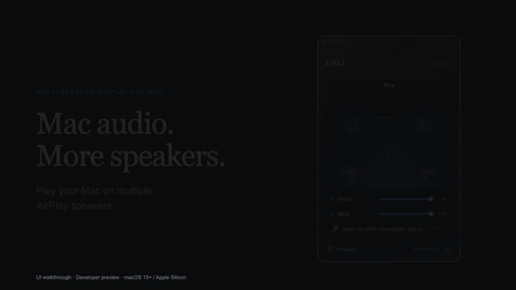
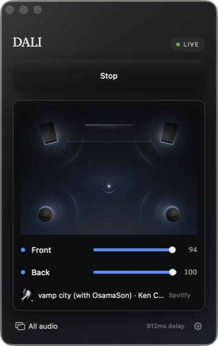
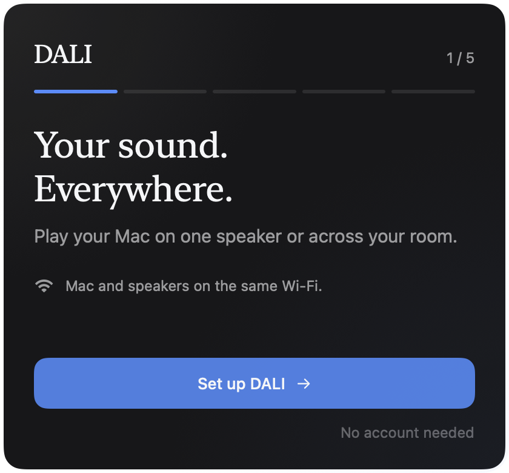
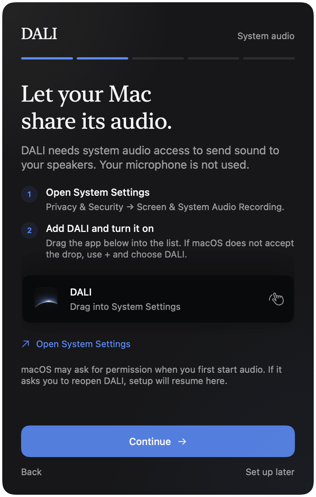
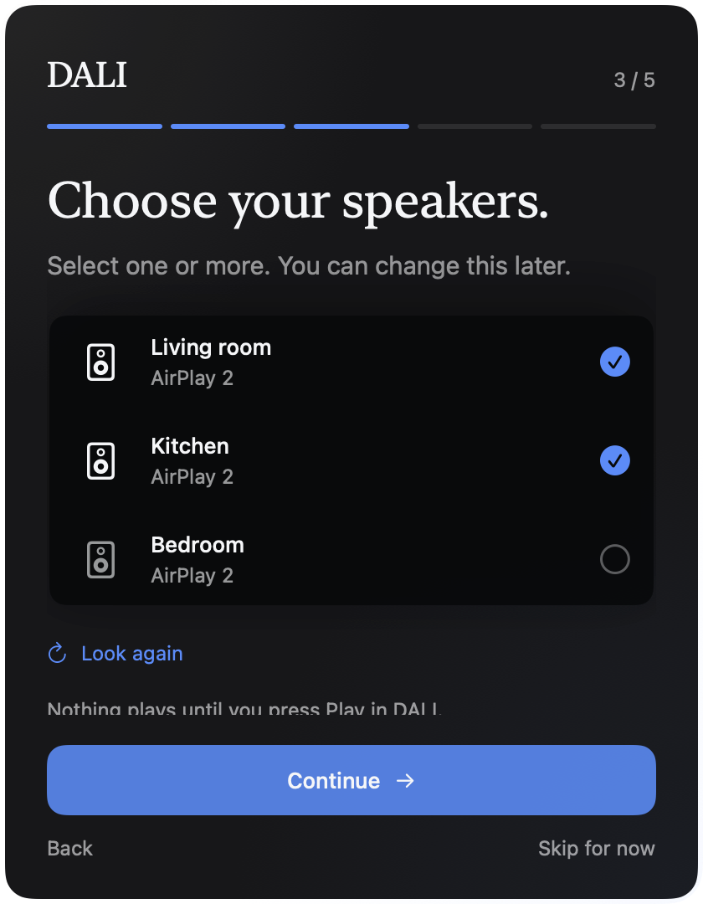
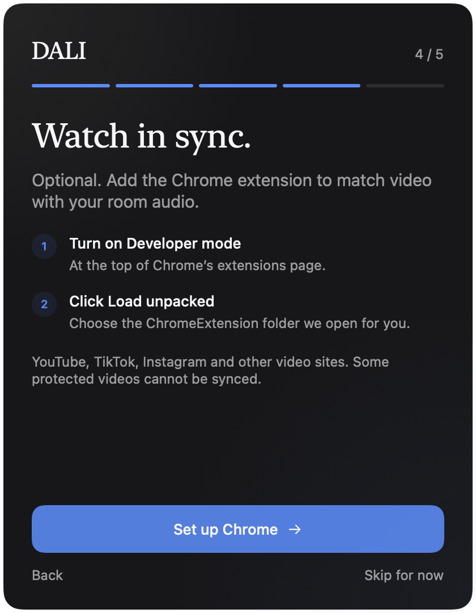
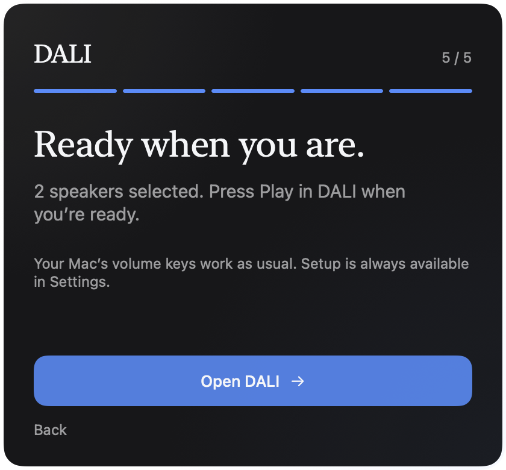

# DALI — Multi-speaker AirPlay for Mac

### Play your Mac’s audio on multiple AirPlay speakers.

DALI is an open-source macOS app for **multi-room AirPlay audio**. Send your Mac’s system audio or a selected app to multiple AirPlay speakers, choose which speakers play, and control their volume from one window.

For watching videos, the optional **DALI Video Sync** Chrome extension delays supported web video to match the room’s audio.

[Preview release](https://github.com/fortun8te/dali/releases/tag/v1.2.0-preview.1) · [Setup](docs/getting-started.md) · [Build from source](docs/building.md) · [Privacy](PRIVACY.md) · [Report an issue](https://github.com/fortun8te/dali/issues)

> **Developer preview.** Source and extension packages are available. A signed, notarized Mac download and Chrome Web Store distribution are not available yet. Apple Silicon is the current engine target. Physical speaker timing and live platform compatibility need broader testing.

Looking for a way to **play audio on multiple speakers from a Mac**? Start with the [multi-speaker AirPlay guide](docs/multi-speaker-airplay-mac.md), or [help test the preview](#help-test-multi-speaker-airplay).

## See the app

[Watch or download the 20-second video](https://github.com/fortun8te/dali/releases/download/v1.2.0-preview.1/DALI-AirPlay-demo.mp4). A walkthrough of the real UI, not a physical speaker-sync test. [Remotion source](tools/promo).

Room playback, speaker levels, and the current audio source in one compact window.

  

### Guided setup

A short setup flow in the same style as the app. Click any screen to see it at full size.

<table>
  <tr>
    <td align="center"><strong>Welcome</strong></td>
    <td align="center"><strong>Allow Mac audio</strong></td>
    <td align="center"><strong>Choose speakers</strong></td>
  </tr>
  <tr>
    <td></td>
    <td></td>
    <td></td>
  </tr>
</table>
<table>
  <tr>
    <td align="center"><strong>Optional video sync</strong></td>
    <td align="center"><strong>Ready to play</strong></td>
  </tr>
  <tr>
    <td></td>
    <td></td>
  </tr>
</table>

[View the full UI gallery, including settings →](docs/ui-tour.md)

## What it does

- Sends system audio, or audio from a selected app, to your AirPlay speakers.
- Lets you choose speakers, adjust their volume, and see when one needs attention.
- Keeps the existing compact dark interface, with guided setup for new users.
- Gives supported HTML video players a matching picture delay, with recovery when the app reconnects or a feed changes clips.
- Keeps audio and playback status local. No DALI account or subscription.

## Video compatibility

| Video source | Implementation | Verification |
| --- | --- | --- |
| YouTube and Shorts | HTML video timing, seek/pause handling, visible clip selection | Automated player and feed regressions; live-site testing still needed |
| TikTok and Instagram Reels | Visible active video selection, recycled element and source handling | Automated feed fixtures; login-dependent live-site testing still needed |
| Other HTML video players | Generic HTML video support | Depends on the player and browser restrictions |
| DRM, protected video, picture-in-picture and fullscreen | Browser restrictions can prevent delayed rendering | Not guaranteed; use normal playback when unavailable |
| Live streams | Player-dependent | Not guaranteed |

The extension matches the delay reported by DALI. It cannot measure the sound at your seat; speaker hardware and network conditions still matter.

## Get started

You need macOS 15 or later, Apple Silicon for the current engine build, Chrome, and AirPlay speakers reachable on the same local network. See the [setup guide](docs/getting-started.md). Existing DALI users keep their saved room settings and skip first-run onboarding.

For contributors, start with [building](docs/building.md), [compatibility tests](docs/compatibility.md), and [release requirements](docs/releasing.md).

## Help test multi-speaker AirPlay

Have two or more AirPlay speakers and an Apple Silicon Mac? We’re looking for early testers to help check real speaker combinations, room timing, and video playback.

[Join the early-tester discussion](https://github.com/fortun8te/dali/discussions/1) · [Get the developer preview](https://github.com/fortun8te/dali/releases/tag/v1.2.0-preview.1) · [Share a compatibility report](https://github.com/fortun8te/dali/issues/new?template=speaker-compatibility.md) · [See all seven UI screens](docs/ui-tour.md)

Please include your macOS version, speaker models, number of speakers, and whether audio or video drifted. Leave private device names and network addresses out of reports. A signed, ready-to-install Mac release is still pending, so testing currently requires a source build.

If DALI solves a problem you care about, star the repository to make it easier to find again, or share it with someone building a multi-room Mac audio setup.

## Built on OwnTone

DALI uses a modified [OwnTone](https://github.com/owntone/owntone-server) engine for AirPlay playback. The modified source, upstream commit, and build notes are included under `third_party/owntone` and `third_party/README.md`. The app and extension are MIT licensed; OwnTone and other dependencies retain their own licenses.

DALI is an independent project and is not affiliated with DALI Speakers, Apple, Google, YouTube, TikTok, or Instagram.
