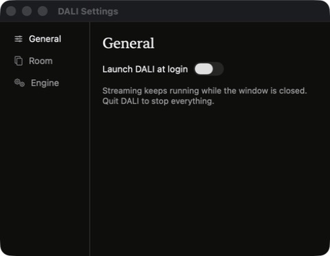

# DALI UI gallery

[Back to the project](../README.md)

Main-window and settings images are captures of the installed app. Setup images are rendered from the current onboarding code with sample speakers.

## Room playback

The installed room interface during playback. Speaker levels, audio source, and now-playing information stay together.

## Welcome

The current onboarding preview. No account or decorative illustrations.

## System audio permission

Open System Settings directly, then drag DALI into the permission list or use the macOS + button.

## Speaker selection

Choose one or more AirPlay speakers. These preview names are sample devices.

## Chrome video sync

Optional browser setup, with the extension folder prepared by DALI.

## Ready to play

Return to the app and start playback when ready.

## General settings

The installed app’s settings window. Opening settings does not stop room audio.

